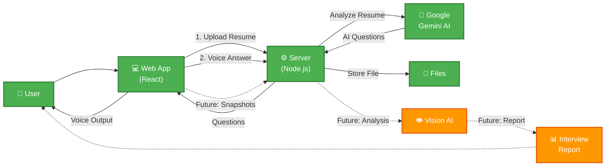

# Valora - System Architecture



## 📖 How It Works

**Current Features:**
1. 📄 **Upload Resume** → User uploads their resume
2. 🤖 **AI Analysis** → Gemini AI reads resume and creates interview questions
3. 🎤 **Live Interview** → User answers questions via voice
4. 🗣️ **Natural Conversation** → AI responds like a real interviewer

**Future Features:**
- 📸 **Webcam Snapshots** → Capture behavior during interview
- 👁️ **Behavior Analysis** → AI analyzes facial expressions & body language
- 📊 **Interview Report** → Get detailed performance report with scores and feedback

## 🎯 Simple Flow

```
User → Upload Resume → AI Creates Questions → Voice Interview → 
[Future: Webcam Analysis → Performance Report]
```

